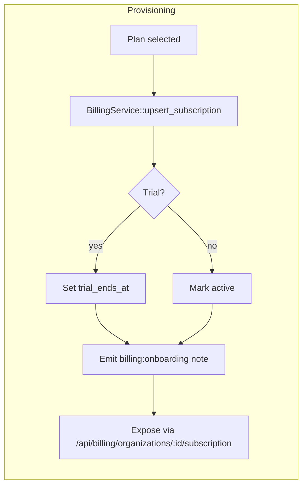
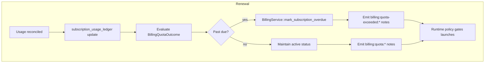
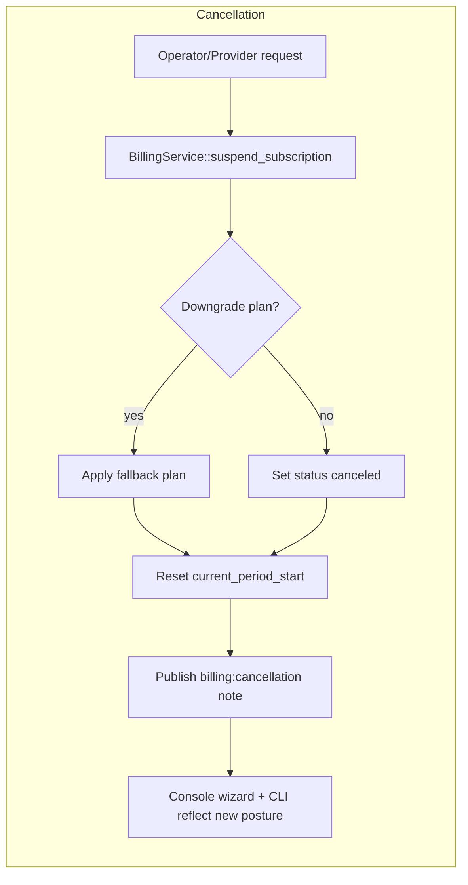

# SaaS Commercialization Overview

This document captures the technical design for commercializing the MCP Host platform, spanning billing, onboarding, and provider marketplace surfaces. The goal is to expose self-service paths while preserving compliance, auditability, and runtime policy integrity.

## Self-service onboarding portal

The public `/onboarding` funnel layers on top of the billing and organizations APIs so new administrators can self-serve the commercialization loop:

- Registration calls `/api/register` and `/api/login` to establish an authenticated session.
- Organization provisioning posts to `/api/orgs` before fetching `/api/billing/catalog` for plan comparison.
- Plan selection writes through `/api/billing/organizations/:id/subscription` with optional trial windows.
- Teammate invites post to `/api/orgs/:id/invitations` and can be redeemed via `/api/orgs/invitations/:token/accept`.
- Invitees launch `/onboarding/invite/[token]`, where the `AcceptInvitation` component guides registration or sign-in before invoking the acceptance API and surfacing success state.

## Policy Integration

Runtime policy now calls `BillingService::enforce_quota` when computing placement decisions. Failures produce `billing:subscription-missing`, `billing:quota-exceeded:*`, or `billing:error:*` notes and flip `evaluation_required`/`governance_required` flags to block launches until entitlements are restored.

## Subscription Lifecycle Diagrams

These diagrams mirror the console onboarding wizard and CLI contracts so operators can trace plan changes from provisioning through suspension without combing through raw SQL joins.

## Renewal Automation

`backend/src/billing/scheduler.rs` (`key: billing-renewal-scheduler -> automate overdue handling`) drives a lightweight renewal worker that replaces placeholder provider callbacks. The job runs every `BILLING_RENEWAL_SCAN_INTERVAL_SECS` seconds (default: 300), marks active/trialing subscriptions `past_due` once their computed renewal window or trial end elapses, and enforces a grace window controlled by `BILLING_PAST_DUE_GRACE_DAYS` (default: 3). When the grace window expires the worker downgrades organizations to the optional fallback plan specified by `BILLING_FALLBACK_PLAN_CODE`; if no fallback is configured it suspends the subscription in-place. SQLx-backed coverage in `backend/tests/billing_scheduler.rs` validates overdue detection, fallback downgrades, and suspension flows end-to-end so the automation can graduate alongside the provider integrations.

## Provider Integration

`StripeLikeAdapter` demonstrates how billing providers can map webhook payloads into `BillingService::upsert_subscription`. A future job worker will reconcile usage deltas by invoking `record_usage` with provider-reported metering data.
